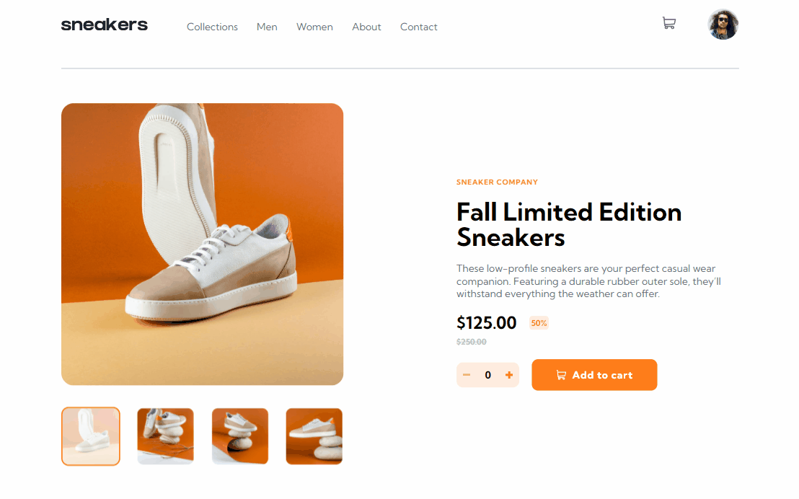

👟 Exemplo de uma página de compra de um E-commerce utilizando React, TypeScript e Sass.

## Desafio do site Frontend Mentor.

 

  

 

## 🔨 Funcionalidades do projeto

Neste projeto, tive a oportunidade de aplicar meus conhecimentos em React, onde utilizei a ContextAPI para o gerenciamento do estado do carrinho. Desde que comecei a utilizar TypeScript, me apaixonei, pois apreciei imensamente a experiência de desenvolvimento com essa linguagem. Além disso, a estilização com Sass proporcionou-me liberdade criativa, ao mesmo tempo em que não foi tão diferente de usar CSS puro.

 

## 🚀 Tecnologias

Este projeto foi desenvolvido com as seguintes tecnologias:

- ✔️ React
- ✔️ TypeScript
- ✔️ Sass

 

Feito por Gabriel Costa 👋🏾 [Veja meu Linkedin](https://www.linkedin.com/in/gabrielcostadev/)
